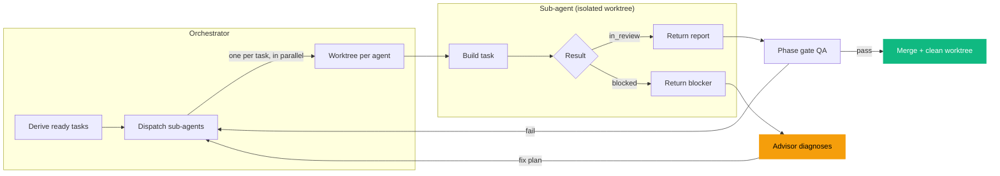
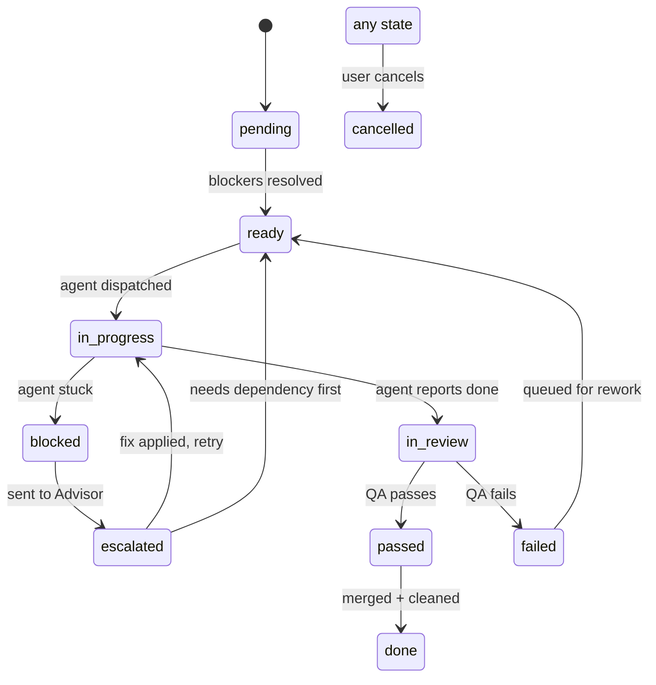

# /buildthis - Autonomous Project Orchestrator for Claude

A single skill file that turns Claude into a full project manager. One command decomposes a plan, spins up parallel sub-agents in isolated git worktrees, runs QA, tracks costs, and delivers a tabbed HTML report.

## How It Works

```mermaid
flowchart TD
    A["/buildthis &#60;input&#62;"] --> B["0. Intake"]
    B --> |"file, folder, URL, or inline text"| C["1. Assess"]
    C --> |"risk, complexity, spec gaps"| D["2. Onboard"]
    D --> |"budget tier, parallelism, steering"| G1{{"GATE 1: Config confirmed"}}
    G1 --> |"optional"| R["Research pass"]
    G1 --> E["3. Decompose"]
    R --> E
    E --> G2{{"GATE 2: Plan approved"}}
    G2 --> |"approve"| F["4. Build loop"]
    G2 --> |"refine"| E
    F --> |"parallel sub-agents in isolated worktrees"| H["5. Phase gate"]
    H --> |"QA pass"| I{"More phases?"}
    H --> |"QA fail"| F
    I --> |"yes"| F
    I --> |"no"| J["6. Master review"]
    J --> |"confidence scoring + final fix"| K["7. HTML report"]
    K --> G4{{"GATE 4: Production review?"}}
    G4 --> |"yes"| L["8. Last Prompt audit"]
    G4 --> |"no"| M["Done"]
    L --> M

    style A fill:#7C3AED,stroke:#7C3AED,color:#fff
    style G1 fill:#F59E0B,stroke:#F59E0B,color:#000
    style G2 fill:#F59E0B,stroke:#F59E0B,color:#000
    style G4 fill:#F59E0B,stroke:#F59E0B,color:#000
    style M fill:#10B981,stroke:#10B981,color:#fff
```



### The Build Loop (Stage 4) in Detail



### Task State Machine



## What It Does

`/buildthis` accepts any kind of build request and runs it through an eight-stage pipeline:

1. **Intake** - Classifies your input (file, folder, URL, or inline text) and normalizes it into a canonical plan source
2. **Assessment** - Reads the plan and the repo, flags risks and complexity, detects the target environment, and identifies gaps in the spec that would produce generic output
3. **Onboarding** - Asks targeted steering questions: budget tier, parallelism, target environment, design direction, and custom questions for every gap the assessment found
4. **Decomposition** - Breaks the plan into phases and tasks, each with acceptance criteria, test parameters, and blocker dependencies
5. **Build loop** - Dispatches sub-agents in parallel, each in its own isolated git worktree so they never collide on files
6. **Phase gate** - Runs QA on every completed task, merges passing work into the feature branch, cleans up worktrees, and verifies zero artifacts remain before moving on
7. **Master review** - Scores confidence across five dimensions (correctness, security, maintainability, test coverage, performance) with itemized deductions, then runs a final fix pass
8. **Report** - Generates a self-contained tabbed HTML file and opens it in your browser

## Key Features

- **Worktree isolation** - Each concurrent task gets its own git worktree, preventing agent collisions
- **Strict state machine** - 10 states with defined transitions, survives session drops and context resets
- **Three-tier escalation** - Builder agents, Advisor agents, and the Orchestrator, each with a defined role
- **Budget tiers** - Economy, Business, and First Class model configurations for different cost/quality tradeoffs
- **Sensitivity profiles** - Standard (dev), Elevated (stage), Maximum (production) with increasing safeguards
- **Cost tracking** - Per-phase token usage and estimated USD in `Build/cost.json`
- **Design bar** - Awwwards-premium default for all UI work; generic output is treated as a QA failure
- **Resumable builds** - `Build/tasks.json` persists state so interrupted builds can resume cleanly

## Install

**As a slash command (recommended):**

```bash
# Per project
cp SKILL.md .claude/commands/buildthis.md

# Global (all projects)
cp SKILL.md ~/.claude/commands/buildthis.md
```

**As an auto-triggering skill:**

```bash
mkdir -p .claude/skills/buildthis
cp SKILL.md .claude/skills/buildthis/SKILL.md
```

## Usage

The input can be a file, a directory, a URL, or just plain text describing what you want. Each of these is a separate example:

**Point it at a plan file:**
```
/buildthis project_plan.md
```

**Give it a scope folder (reads everything inside):**
```
/buildthis Docs/scope/
```

**Just describe what you want in plain English:**
```
/buildthis add OAuth login with Google and GitHub
```

**Or hand it a docs URL:**
```
/buildthis https://docs.example.com/prd
```

You can also trigger it conversationally without the slash command:
```
buildthis: add dark mode
```

If a previous build was interrupted, `/buildthis` detects the existing `Build/tasks.json` and offers to resume from where it left off.

## Requirements

- Claude Code or Claude Desktop with skills support
- No external dependencies

## License

MIT

## Author

Built by [Imiel Visser](https://imiel.dev) ([@imiel_visser](https://x.com/imiel_visser))

Read the full breakdown: [I Built a Skill That Turns Claude Into a Project Manager](https://imiel.dev/blog/buildthis-autonomous-project-orchestrator-2026-guide)
